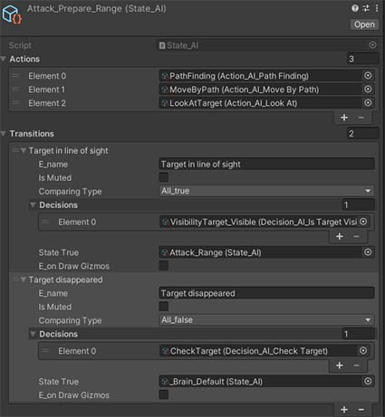

# StateMachine (ScriptableObject based)

Abstract layer of State Machine. With example of use. \
After creating all scripts, it's very easy to change states just in the inspector (by drag&drop scriptableObjects without coding).

## How to setup

1. Create script `Manager.cs` and inherit from `AStateMachine.cs`
2. Create script `Action.cs` and inherit from `AAction.cs`
3. Create script `Decision.cs` and inherit from `ADecision.cs`
4. Create script `State.cs` and inherit from `AState.cs`
5. Create scriptableObjects of `Action`, `Decision`, `State`.
6. Setup `State` by `Action` and `Decision`\

7. Add `Manager` to character and put `State` to the `Manager.DefaultState`

> Create partial `StateMashine.cs` for easy adding new features through creating new scripts

## Links

* [Unity tuttorial about stateMachine](https://www.youtube.com/watch?v=cHUXh5biQMg&list=PLX2vGYjWbI0ROSj_B0_eir_VkHrEkd4pi&index=1)
* [Another one tuttorial](https://www.youtube.com/watch?v=l90d4z5nVWI)
* [Real game stateMachine based](https://www.youtube.com/watch?v=7mx1HeOkSh4)

